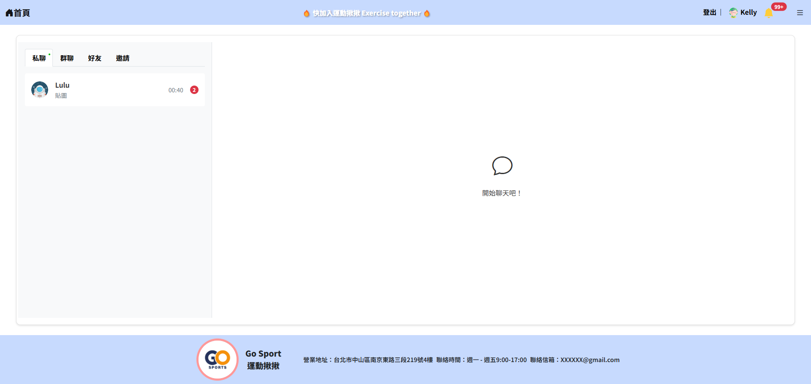
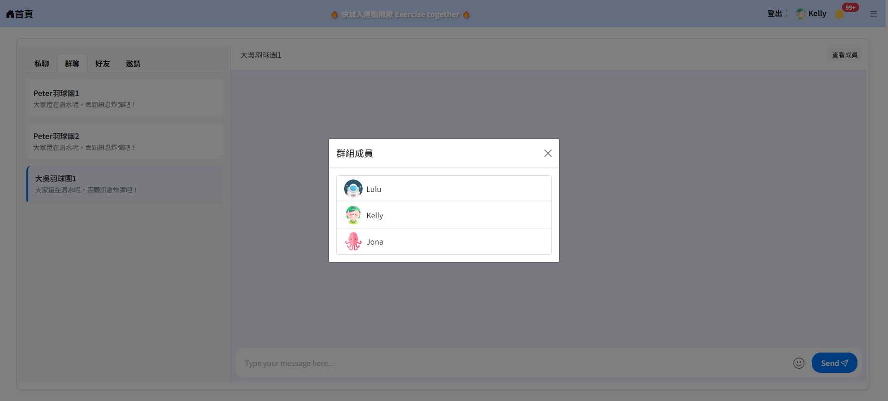

# 運動揪揪
系統說明：運動揪揪是一個運動揪團媒合平台，提供揪團、論壇、聊天室、運動用品商城，以及後台會員與商家管理功能。

負責模組：好友管理/聊天室

## 使用技術

### 後端技術：
- **Spring Boot**：三層式架構開發 API 和處理後端業務邏輯。
- **Hibernate**：用於簡化資料庫操作，執行查詢、插入和更新等操作。
- **MySQL**：記錄好友關係。
- **Redis**：
  1. **記錄使用者查看的聊天室**
  2. **記錄未讀訊息數**：
     - 若接收者不在聊天室中，Redis 會記錄未讀訊息數。
  3. **記錄聊天內容**

- **Websocket**：
  1. **一對一聊天/群組聊天**：
      - 使用 WebSocket 為每位使用者訂閱專屬的通訊連線。發送者與接收者 ID、訊息封裝後，直接推送至特定通道。
  2. **即時收到好友邀請通知、成為好友通知**：
     - 使用 WebSocket 發送即時好友邀請通知、成為好友通知
- **Swagger**：提供清晰的 API 文件，方便測試。

### 前端技術：
- 使用 HTML5, CSS, JavaScript

---
## 功能列表

| 🔧 功能名稱                         | 描述                                                                                                           | 🖼 圖片                                                                 |
|----------------------------------|--------------------------------------------------------------------------------------------------------------|--------------------------------------------------------------------|
| **1. 好友管理** |
| 1.1【模糊搜尋】| 支援模糊搜尋||
| 1.2【發送好友邀請】| 發送好友邀請，對方可以即時收到好友通知||
| 1.3【取消好友邀請】| 取消好友邀請||
| 1.4【接受好友邀請】| 接受好友邀請，好友列表出現新好友||
| **2. 一對一聊天**   |
| 2.1【傳送訊息/貼圖】    | 傳送具時間戳記的訊息/貼圖||
|2.2【未讀訊息通知】|聊天室顯示未讀訊息數。 若聊天列表有未讀訊息，頁籤會出現綠色點做為提醒。||
| 2.3【接收訊息/貼圖】| 即時接收好友傳來的訊息||
| **3. 群組聊天** |
| 3.1【查看群組成員】| 查看群組成員||
| 3.2【群組傳送訊息/貼圖】| 傳送具時間戳記的訊息/貼圖||
| 3.3【群組未讀訊息通知】| 聊天室顯示未讀訊息數。 若聊天列表有未讀訊息，頁籤會出現綠色點做為提醒。||
| 3.4【群組接收訊息/貼圖】| 即時接收好友傳來的訊息||

